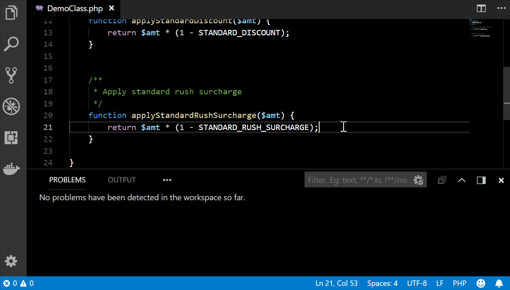

# PHP TDD Visual Studio Code Extension

This is a Visual Studio Code extension to assist with TDD in PHP.  It includes tools that help to create, run and edit unit tests in your PHP application.  By default, this extension uses PHPUnit, but it can be configured to run other unit test frameworks.

## Features



* Run a method or class unit test by positioning cursor and running the Run Unit Test command (default hotkey is Ctrl+Alt+T)
* Results are displayed in the status bar, unit test failures display as warnings in the Problems list
* Automatically creates a unit test (and class) for you if one is not already created
* Automatically creates PSR-4 namespaces in your composer.json so your unit tests are easier to write

## Requirements

* [PHP](https://secure.php.net/downloads.php) (for tokenizing source code)
* [Composer](https://getcomposer.org/download/) installed globaly (to install PHPUnit and to update namespace directories)

Note:  As of version 0.1.0, if your PHP does not have JSON and tokenization built into it (i.e. they get loaded as extensions), they will get properly loaded if the
enablePHPExtensions configuration property is set to true.

## Operation

### Initialize

Make sure you have PHP and Composer installed, and that you can run `php` and `composer` from a command prompt / shell.  If not, use the links in the [Requirements](#Requirements) section to install.

To initialize the php-tdd, open a Workspace and run the command "PHP TDD: Initialize PHP Unit Test Project", which will do the following (by default configuration).  The extension will copy files required for unit tests to the workspace folder.  It will then ensure that Composer and PHPUnit are installed in the `vendor` folder.

### Run or Edit a Single Unit Test

Once php-tdd is initialized, you can open a PHP file and move your cursor to a function or class (outside of a function) and run the command "PHP TDD: Run PHP Unit Test".  If there is a unit test defined as a "@testFunction" comment line, it will be run, and the results shown in the status line (pass or fail).  If there is not a unit test defined, a unit test will be created and brought up to edit.  You can later edit the unit test by moving your cursor to the function or class, and run the command "PHP TDD: Edit PHP Unit Test".

### All PHP-TDD Commands

* Initialize PHP Unit Test Project: Initialize, or re-initialize, files required for php-tdd unit test project files to the current workspace folder.  If there is more than one workspace folder, and no file is open, you will be prompted to select the workspace folder.
* Edit PHP Unit Test: Create or edit a unit test for the currently selected function or class.  If a function or class is not selected at the current cursor position, a warning will be displayed.
* Run PHP Unit Test: Run a unit test for the currently selected function or class.  If no test function is defined, one will be created and activated for editing.  If a function or class is not selected at the current cursor position, a warning will be displayed.
* Run PHP All Unit Tests: Run all unit tests
* Run PHP All Unit Tests With Coverage: Run all unit tests, including code coverage, and then display the code coverage report
* Clear All Unit Test Warnings & Errors: Clear any warnings for failed unit tests and the PHP-TDD output window

### About the Base Unit Test Case

The base unit test case implements the following three reflection-based methods to make unit testing a little more convenient.  

* `setProperty($object, $propertyName, $propertyValue)`: Set the value for any property (even if private)
* `getProperty($object, $propertyName)`: Get the value for any property (even if private)
* `callMethod($object, $methodName, $arguments = [])`: Call any method (even if private)

To use any of these, reference the method using `$this` in any test class.  For example:

```php
    /**
     * @covers MainModule\DemoClass::myPrivateMethod
     **/
    public function testDemoClassMyPrivateMethod() {
        $obj = new DemoClass();
        $this->setProperty($obj, '_privateProperty', 'foo');
        $this->assertEquals('bar', $this->callmethod($obj, 'myPrivateMethod'));
    }
```

This is provided as a convenience so that you can test _any_ function as you are working on it.  If you are categorically opposed to unit testing protected/private functions, don't use it :)

## Configuration

### Extension Settings

This extension contributes the following settings:

* `php-tdd.testSubdirectory`: Set the workspace folder directory where unit test project files are copied to and unit tests are stored (default = `tests/unit`)
* `php-tdd.testClassTemplateFile`: Sets the file to use as a template when creating new unit testes (default = `templates/PHPUnitTestCase.php`)
* `php-tdd.enableAutoRun`: If set to true, unit tests are run as code is edited)
* `php-tdd.enablePHPExtensions`: If set to true, JSON and tokenize PHP extensions will be explicity loaded when parsing PHP code
* `php-tdd.commands.directory`: The current working directory set when unit tests are run (default = `__WORKSPACE_DIRECTORY__`)
* `php-tdd.commands.runUnitTest`: The command to run a single unit test (default = `./vendor/bin/phpunit --testdox -c __TEST_SUBDIRECTORY__/phpunit.xml --filter __FUNCTION__ __TEST_SUBDIRECTORY__`)
* `php-tdd.commands.runAllUnitTests`: The command to run all unit tests (default = `./vendor/bin/phpunit --testdox -c __TEST_SUBDIRECTORY__/phpunit.xml __TEST_SUBDIRECTORY__`)
* `php-tdd.commands.runCodeCoverage`: The command to run all unit tests and generate a code coverage report (default = `./vendor/bin/phpunit --testdox -c __TEST_SUBDIRECTORY__/phpunit.coverage.xml __TEST_SUBDIRECTORY__`)
* `php-tdd.commands.codeCoverageReport`: The path to the code coverage report generated by runCodecoverage (default = `./__TEST_SUBDIRECTORY__/coverage/index.html`)
* `php-tdd.composer.enableInstall`: If set to true, Composer will be run to install required packages when initializing a test project (default = `true`)
* `php-tdd.composer.enableNamespace`: If set to true, PHP-TDD will ensure there is a PSR-4 namespace defined in composer.json for files tha are tested (default = `true`)
* `php-tdd.composer.packagesRequired`: A list of Composer packages to install if `enableInstall` is true (default = `["composer/composer"]`)
* `php-tdd.composer.packagesDevelopment`: A list of Composer development packages to install if `enableInstall` is true (default = `["composer/composer"]`)
* `php-tdd.composer.commands.directory`: The current working directory set when Composer is run (default = `__WORKSPACE_DIRECTORY__`)
* `php-tdd.composer.commands.require`: The command to run Composer require to install packages (default = `composer require __FLAGS__ __PACKAGE__`)
* `php-tdd.composer.commands.update`: The command to run Composer update to install packages (default = `composer update`)
* `php-tdd.composer.commands.dumpAutoload`: The command to run Composer autoload updates to install packages (default = `composer dump-autoload`)

### Configuration Variables

The following configuration variables can be inserted into commaands and directory

* \_\_WORKSPACE_DIRECTORY\_\_: the workspace directory of the currently selected file
* \_\_TEST_SUBDIRECTORY\_\_: the subdirectory (relative to the workspace directory) where unit test files are located
* \_\_FUNCTION\_\_: the name of the unit test to run (for `runUnitTest`)
* \_\_PACKAGE\_\_: used to specify the name of the package when installing a Composer package
* \_\_FLAGS\_\_: used to toggle "--dev" when installing Composer packages

### Docker

If you want to run PHPUnit and Composer from Docker containers, php-tdd includes a Docker harness.  You will need to override the following configuration settings in your workspace:

```json
    "php-tdd": {
        "commands": {
            "runUnitTest": "docker-compose -f __TEST_SUBDIRECTORY__/docker-compose.yaml run phpunit --testdox -c __TEST_SUBDIRECTORY__/phpunit.xml --filter __FUNCTION__ __TEST_SUBDIRECTORY__",
            "runAllUnitTests": "docker-compose -f __TEST_SUBDIRECTORY__/docker-compose.yaml run phpunit --testdox -c __TEST_SUBDIRECTORY__/phpunit.xml __TEST_SUBDIRECTORY__",
            "runCodeCoverage": "docker-compose -f __TEST_SUBDIRECTORY__/docker-compose.yaml run phpunit-coverage --testdox -c __TEST_SUBDIRECTORY__/phpunit.coverage.xml __TEST_SUBDIRECTORY__"
        },
        "composer": {
            "commands": {
                "require": "docker-compose -f __TEST_SUBDIRECTORY__/docker-compose.yaml run composer require __FLAGS__ __PACKAGE__",
                "update": "docker-compose -f __TEST_SUBDIRECTORY__/docker-compose.yaml run composer update",
                "dumpAutoload": "docker-compose -f __TEST_SUBDIRECTORY__/docker-compose.yaml run composer dump-autoload"
            }
        }
    }
```

## Release Notes

See (./CHANGELOG.md)[CHANGELOG.md] for release information.

## To-Do's

* Using PHP to parse was a brute-force shortcut, if anybody shows interest in this plug-in, should probably replace with regular expressions dirctly in Javascript
* Define a better behavior for Run and Edit when cursor is in a test function

## Development

Unit tests can be run by executing ```npm run unit-test``` or by loading the project in Visual Code and launch the "Unit Tests" tasks.  Note that unit tests are run without launcing Visual Code.  If you want to run the tests with Visual Code running, launch the "Integration Tests" task.